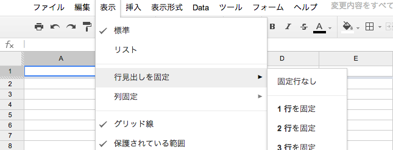
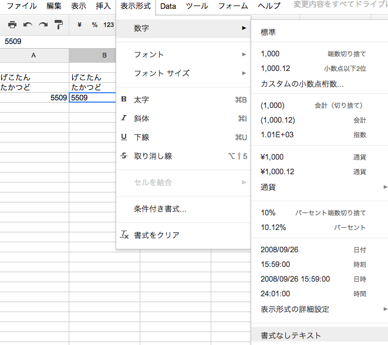

## GoogleSpreadSheetの小ネタ

[@GeckoTang](http://twitter.com/GeckoTang)

---

## Caution!

これから紹介する内容は「知ってるよwww」っていうものも含まれるかもしれません。

---

## スプレッドシートとは

- オンラインで使えるExcelのようなもの。  
- Excelで使える機能や、大体の関数は使える。  
- Excelのマクロ機能はない。  
- その代わりにGoogle Apps Script(GAS)が使える。  
- GASはJavaScriptがわかれば大体わかる。  
- 色々な型式(xlsx, pdf, html...)でダウンロードできる

---

## よく使うやつをご紹介

- 行、列見出しを固定する
- データの検証と条件付き書式を使う
- フィルタ機能を使う
- 数字の表示書式を変更する
- GASを使って、◯◯する

---

## 行、列見出しを固定する

- 編集 > 行見出しを固定 > n行を固定  
- 編集 > 列固定 > n列を固定
- 固定された境界をドラッグして移動できる



<small>Excelだとこれやるの地味にめんどくさい…</small>

---

### データの検証(1)

- ドロップダウンリストを作成します。
- セルを右クリック > データの検証 > リストを直接指定
- 保存（消す場合は**検証を解除**を押す）


---

### データの検証(2)

- リストを範囲で指定
- 入力エリアのグリッドなアイコンをクリックして、好きなセルを選択することが出来る
- 保存


---

### 条件付き書式

- セルの値によって色をつけたりする
- 背景色と前面色を指定することが可能
- 条件は色々ある（セルが**日付**かつ**明日**だったら〜とか


---

### フィルタ機能を使う

- Data > フィルタ
- １行目が見出し行になり、昇降のソートや情報のフィルタが出来る。


<small>※並び替えたい範囲を選択して、右クリックから**範囲を並び替え...**とかでもよい。</small>
---

### 数字の表示書式を変更する



---

### GASを使ってHello Worldする

どうみてもJavaScriptです

```
function myFunction() {
  Browser.msgBox("Hello World！");
}
```

- ツール > スクリプトエディタ
- コードを入力して、⌘ + Sで保存
- リソース > 現在のプロジェクトのトリガー > 編集時


こうすると編集する度にアラートが出る。

---

### GASで出来ることの一部

- メアド一覧のスプレッドシートから、全員にメール送信
- ガントチャートなどを作る
- TODOリストを作って定期的にメール送信し、進捗報告
- 外部サイトのRSSを取得して毎日メールで整形して送信

---

ご清聴ありがとうございました。
